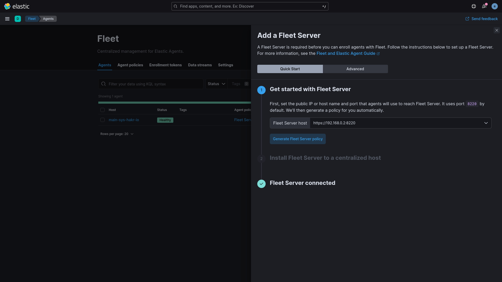
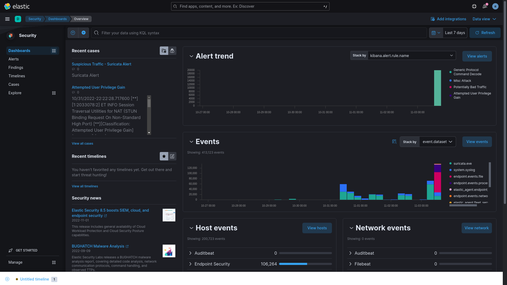

## Elastic

> **Note**  
> Using podman-compose.
>
> curl -o /usr/local/bin/podman-compose https://raw.githubusercontent.com/containers/podman-compose/devel/podman_compose.py
>
> chmod +x /usr/local/bin/podman-compose
>
> alias podman-compose=/usr/local/bin/podman-compose
>

```sh
sudo sysctl -w vm.max_map_count=262144
reboot

# create .env
tee ./.env<<EOF
ELASTIC_VERSION=8.10.2

## Passwords for stack users
#

# User 'elastic' (built-in)
#
# Superuser role, full access to cluster management and data indices.
# https://www.elastic.co/guide/en/elasticsearch/reference/current/built-in-users.html
ELASTIC_PASSWORD='changeme'

# User 'logstash_internal' (custom)
#
# The user Logstash uses to connect and send data to Elasticsearch.
# https://www.elastic.co/guide/en/logstash/current/ls-security.html
LOGSTASH_INTERNAL_PASSWORD='changeme'

# User 'kibana_system' (built-in)
#
# The user Kibana uses to connect and communicate with Elasticsearch.
# https://www.elastic.co/guide/en/elasticsearch/reference/current/built-in-users.html
KIBANA_SYSTEM_PASSWORD='changeme'

# Users 'metricbeat_internal', 'filebeat_internal' and 'heartbeat_internal' (custom)
#
# The users Beats use to connect and send data to Elasticsearch.
# https://www.elastic.co/guide/en/beats/metricbeat/current/feature-roles.html
METRICBEAT_INTERNAL_PASSWORD=''
FILEBEAT_INTERNAL_PASSWORD=''
HEARTBEAT_INTERNAL_PASSWORD=''

# User 'monitoring_internal' (custom)
#
# The user Metricbeat uses to collect monitoring data from stack components.
# https://www.elastic.co/guide/en/elasticsearch/reference/current/how-monitoring-works.html
MONITORING_INTERNAL_PASSWORD=''

# User 'beats_system' (built-in)
#
# The user the Beats use when storing monitoring information in Elasticsearch.
# https://www.elastic.co/guide/en/elasticsearch/reference/current/built-in-users.html
BEATS_SYSTEM_PASSWORD=''
EOF

podman-compose up -d
podman-compose exec kibana bin/kibana-encryption-keys generate -f
#copy and paste keys into kibana.yml
```
#

```yaml
## X-Pack settings
## see https://www.elastic.co/guide/en/elasticsearch/reference/current/security-settings.html
#
## X-Pack security credentials
#
xpack.encryptedSavedObjects.encryptionKey: < .... >
xpack.reporting.encryptionKey: < .... >
xpack.security.encryptionKey: < .... >
```
#
```sh
podman-compose down kibana && podman-compose up kibana -d
```
http://localhost:5601

```sh
# generate new password for elastic
podman-compose exec elasticsearch bin/elasticsearch-reset-password --batch --user elastic
```

## Fleet/Agent.

https://www.elastic.co/guide/en/fleet/master/fleet-server.html



```sh
sudo curl -L -O https://artifacts.elastic.co/downloads/beats/elastic-agent/elastic-agent-8.10.2-linux-x86_64.tar.gz
sudo tar xzvf elastic-agent-8.10.2-linux-x86_64.tar.gz
sudo ./elastic-agent-8.10.2-linux-x86_64/elastic-agent install \
--fleet-server-es=http://localhost:9200 \
--fleet-server-service-token=<!INSERT THE GENERATED TOKEN HERE!> \
--fleet-server-policy=fleet-server-policy
```

```pwsh
#For windows endpoints, open powershell as an admin and install the agent with:
$ProgressPreference = 'SilentlyContinue'
Invoke-WebRequest -Uri https://artifacts.elastic.co/downloads/beats/elastic-agent/elastic-agent-8.10.2-windows-x86_64.zip -OutFile elastic-agent-8.10.2-windows-x86_64.zip
Expand-Archive .\elastic-agent-8.10.2-windows-x86_64.zip
cd elastic-agent-8.10.2-windows-x86_64
.\elastic-agent.exe install `
  --fleet-server-es=http://localhost:9200 `
  --fleet-server-service-token=<!INSERT THE GENERATED TOKEN HERE!> `
  --fleet-server-policy=fleet-server-policy
```

## Elastic Agent

[](https://www.youtube.com/watch?v=pnGXjljuEnY)

## Suricata

```sh
podman build -t suricata -f ../suricata/Dockerfile
```

https://suricata.io/

Add the suricata integration in the elastic agent policy, place the correct path to eve.json

https://docs.elastic.co/en/integrations/suricata

## Custom Logs Integration

https://docs-staging.elastic.co/integrations/log


## Elastic Defend


https://www.elastic.co/security

https://www.elastic.co/training/security-quick-start



Product Overview - Configuring Endpoint Security Policy

[](https://www.youtube.com/watch?v=Wnx5b9MxylA)

Happy Threat [Hunting](https://eqlplayground.io/)

[](https://www.youtube.com/watch?v=1mWzwWGfJNo)
