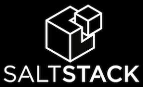
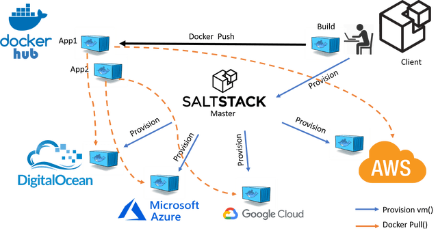

## salt (aka saltstack)

  

What is Salt?

It's automation, infrastructure management. It's data-drive orchestration and remote execution. It's configuration management. It's so much more.

  

Good reads:

https://docs.saltproject.io/salt/user-guide/en/latest/index.html

https://mpolinowski.github.io/docs/DevOps/Salt/2020-06-25--salt-orchestration-for-docker-containers/2020-06-25

https://dev.to/trickvi/let-s-get-started-with-salt-55hb
