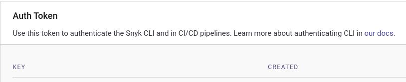
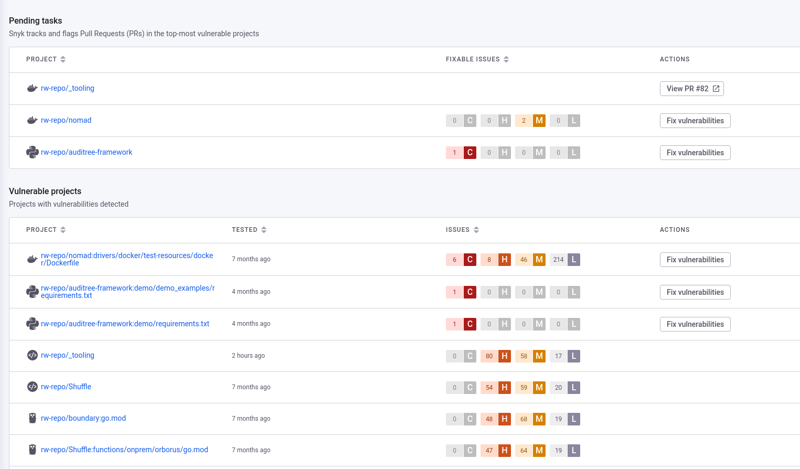
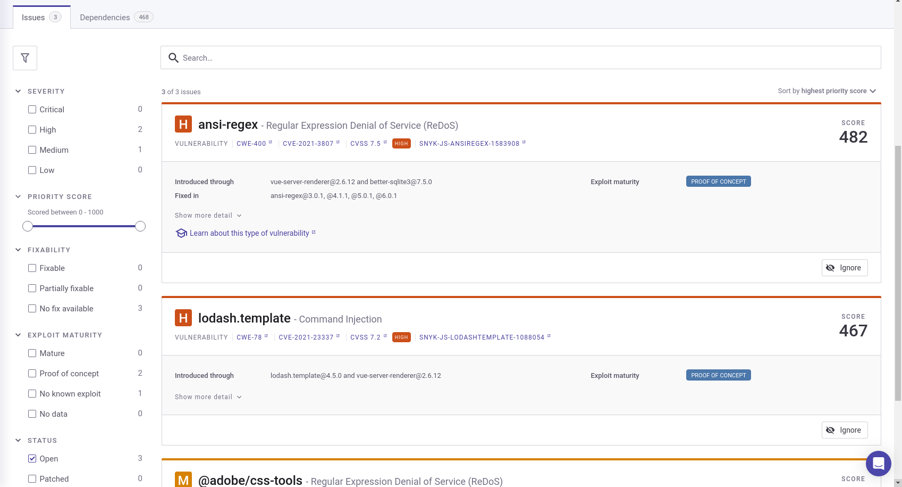
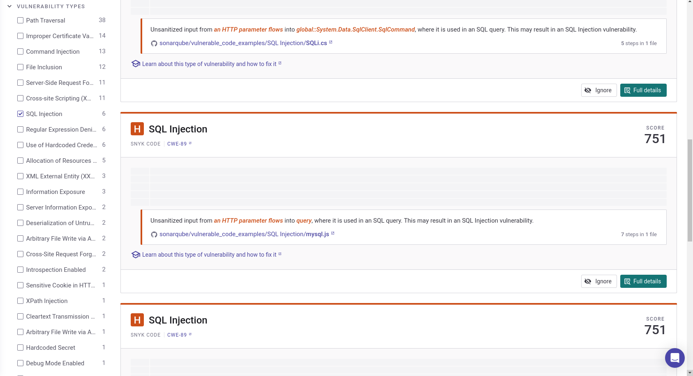
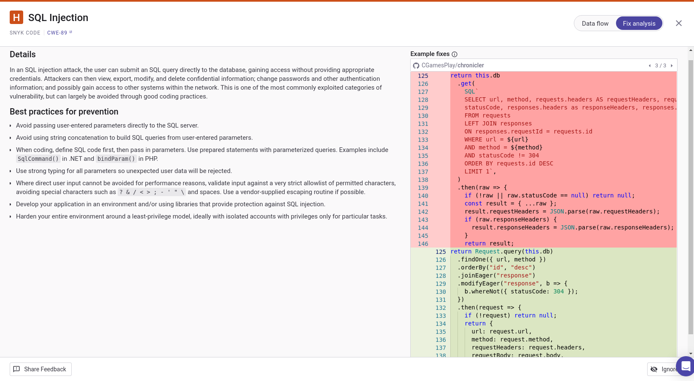

## So Now You Know.

  

[What is snyk?](https://snyk.io/)

a) Sign-up for snyk: https://app.snyk.io/login

b) Generate Token in "Account Settings": 

  

c) Modify the SNYK_API variable with the Auth Token Key in the Dockerfile.

d) Modify the URL and CODE_NAME arguments in the Dockerfile.

>
> **Note**
>
> The "snyk monitor" command sends the results to your projects in https://app.snyk.io/org/<Your Username>

## Example view of the UI:

  

## Dependencies / Modules Vulnerabilities example:

  

## Vulnerability Coverage example:

  

## Fix Analysis example:

  

