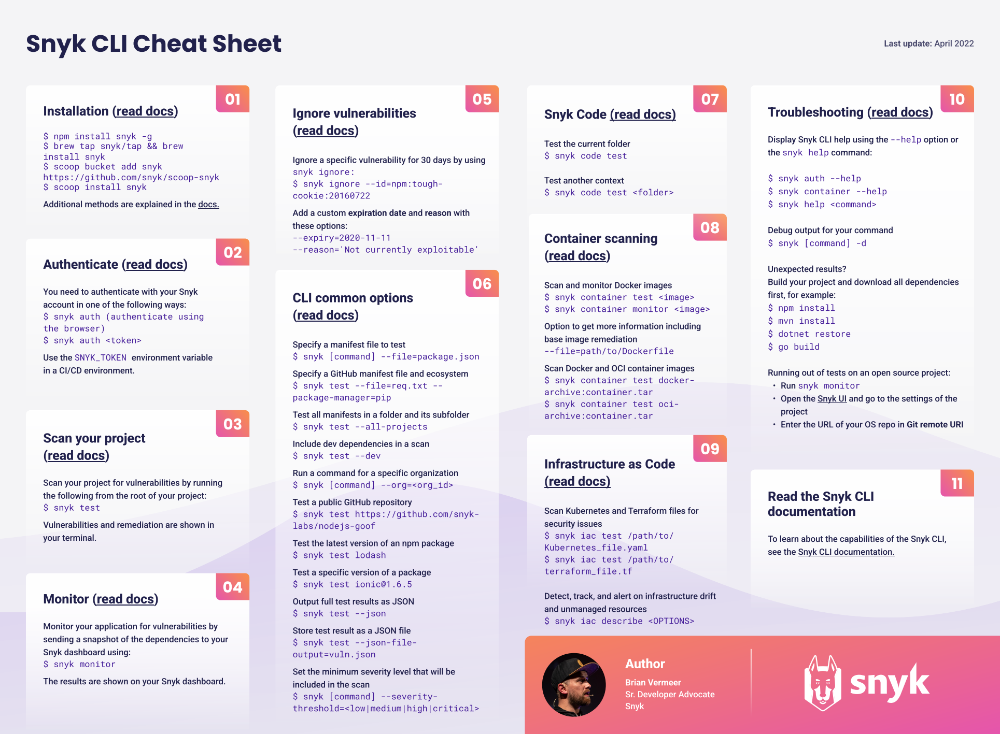

## Demo Usage:

a) Build the container to execute the scan against the codebase source url.

```sh

URL=https://github.com/<user>/<codebase>/archive/refs/heads/main.zip
CODE_NAME=<code name>
SNYK_API=<snyk api key>
OFFLOAD_DIR=/some/path/to/dir

tee snyk_scan.sh<<EOF
#!/bin/bash

# build docker image

podman build -t snyk \
--build-arg URL=$(echo $URL) \
--build-arg CODE_NAME=$(echo $CODE_NAME) \
--build-arg SNYK_API=$(echo $SNYK_API) \
--format docker .

# run container to get reports

podman run --rm -it --name snyk -d snyk

#offload html reports to pwd

podman cp snyk:/home/snyk $(echo $OFFLOAD_DIR)

#container is meant to be built, run scan, send results to snyk account, offload html reports, and destroyed.

podman image prune -f
podman rmi alpine:3.18 -f
podman rmi snyk:latest -f
EOF

chmod +x snyk_scan.sh; ./snyk_scan.sh

```

## Modify the Dockerfile snyk commands to your liking:

<p align="center">
  
</p>

