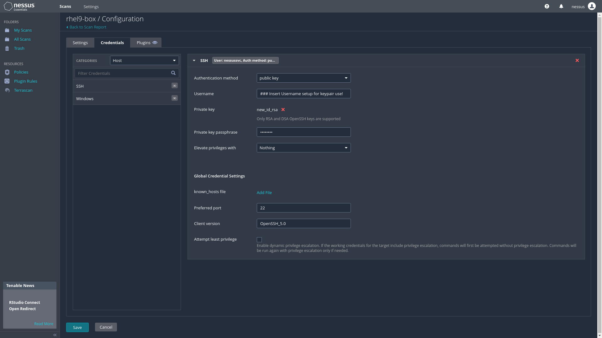

## SSH Keypair Authentication 

```sh
# Create scan user
sudo useradd -m nessus_service && groupadd scan && usermod -aG scan nessus_service
sudo mkdir -p /home/hessus_service/{.ssh,keygen}

cd ./keygen
sudo ssh-keygen -f /home/nessus_service/keygen/new_id_rsa -t rsa
# Insert passphrase for private key
# directory output: /home/nessus_service/keygen 
sudo mv /home/nessus_service/keygen/id_rsa.pub /home/nessus_service/.ssh/authorized_keys
sudo chmod 0600 /home/nessus_service/.ssh/authorized_keys
sudo chmod 0700 /home/nessus_service/.ssh
sudo chown -R nessus_service:nessus_service /home/nessus_service

#on any machine being scanned via ssh
sudo useradd -m nessus_service && groupadd scan && usermod -aG scan nessus_service
sudo tee -a /etc/ssh/sshd_config<< EOF
#***********************************************************
# Enable RSA Key Authentication:
# generated for nessus scanning
#***********************************************************
PubkeyAuthentication yes
RSAAuthentication yes
EOF

#https://community.tenable.com/s/article/Does-Tenable-provide-a-sudoers-list-for-the-commands-plugins-use-requiring-escalation
sudo tee -a /etc/sudoers<< EOF
#***********************************************************
# Set minimum permissions for scanning:
# group is for nessus service account
#***********************************************************
%scan    ALL= NOPASSWD:/usr/sbin/dmidecode, /bin/netstat, /bin/uname
EOF

#scp/rsync authorized_keys to /home/nessus_service/.ssh/
sudo mkdir /home/nessus_service/.ssh
#on the machine where the key was generated
sudo rsync -av /home/nessus_service/.ssh/authorized_keys ssh_account_here@IP.v4.of.target:/home/nessus_service/.ssh/
# ownership/permissions on the target box
sudo chmod 0600 /home/nessus_service/.ssh/authorized_keys
sudo chmod 0700 /home/nessus_service/.ssh
sudo chown -R nessus_service:nessus_service /home/nessus_service
sudo systemctl restart sshd
```
https://community.tenable.com/s/article/SSH-Public-Key-Authentication

#

```sh
# Convert private key before uploading to credentials in nessus scan
sudo ssh-keygen -p -m PEM -f /home/nessus_service/keygen/new_id_rsa
# change ownership of new_id_rsa to current user in order to upload via browser
```

## Scan Credentials

Upload private key for credentialed scan

#


